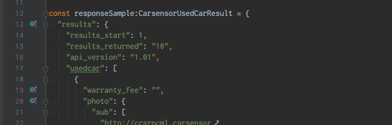

# こわくない関数型プログラミング勉強会@福岡 #3

## jsで副作用を分離するハンズオン
といいつつ、TypeScriptを使います。IntelliJとかで補完が効いて楽だし、型が理解の助けになるので

[toc]

# 0. yarnをインストール

システムにyarnがインストールされていない場合は[公式サイトの「インストール」](https://yarnpkg.com/lang/ja/docs/install/#mac-stable)を見てインストールしてください。

# 1. このプロジェクトをclone
```
git clone https://github.com/tockri/fp_fukuoka.git
```
レポジトリ中の `20191122` が今回の**プロジェクトディレクトリ**です。

好きな場所にコピーするなり移動するなりしてください。もちろんそのまま移動せず使ってもいいです。

## 余談
このプロジェクトは[create-react-app --typescript](https://qiita.com/Julia0709/items/dfce1eed86e82c484040)でサクッと雛形を作りました。便利な世の中。

# 2. 開発を始める準備
## 依存ライブラリのダウンロード
プロジェクトディレクトリで
```
yarn
```
を実行。
## 作業用ディレクトリをコピー
```sh
cd src
cp -r p1 work
```
以上です。

# 3. とりあえず実行してみる

## Chromeを終了して、起動する
### Mac
```sh
open /Applications/Google\ Chrome.app/ --args --disable-web-security --user-data-dir
```
### Windows
```
chrome.exe --disable-web-security --user-data-dir
```


```
yarn start
```
1. 開発用サーバーが起動
2. ブラウザで http://localhost:3000 が開く
3. 中古車一覧が表示される

これ以上なんの機能もありません。表示して終わり。

# 4. 今日編集するソースコード

[src/p1/App.tsx](https://github.com/tockri/fp_fukuoka/blob/master/20191122/src/p1/App.tsx) をコピーした `src/work/App.tsx`をエディタで開いてください。

## 雑な解説
React-hooksを使ったごく簡単なサンプルです。

`useState`や`useEffect`については、[react-hooks 入門でググれば](https://www.google.com/search?q=react-hooks+%E5%85%A5%E9%96%80)たくさん書かれているのでここでは割愛。

#### (1) `setState`は関数
```
const [state, setState] = useState(initialState);
```
`useState`の返り値は配列で、[0]を`state`に、[1]を`setState`に束縛してます。

実は`setState`は関数で、その型は、
```tsx
React.Dispatch<React.SetStateAction<AppState>>
```
です。一見関数に見えないですね。

Reactの型定義ファイルにはこう書かれています。（IntelliJ便利）
```tsx
type SetStateAction<S> = S | ((prevState: S) => S);
type Dispatch<A> = (value: A) => void;
```
`SetStateAction<S>`型の変数には、`S`という値または`(prevState: S) => S`という関数のどちらかが入ります（えー）。が、今日のところは関数を入れないので単に`S`と考えます。

`Dispatch<A>`のほうはシンプルです。`A`型の引数をとって返り値ナシ（void）な関数です。

つまり、`setState`の型はこういうことです。
```tsx
(value: AppState) => void
```

これを`useEffect`の中で一回呼ぶだけのコードです。

## (2) 画面全体の状態`AppState`
```tsx
/**
 * この画面全体のState
 */
type AppState = {
  // 検索結果 | undefined
  searchResult?: CarsensorUsedCarResult
};
```
`App`というコンポーネントの状態なので`AppState`。

検索結果を表示するだけのコンポーネントなので、`AppState`のメンバーは`searchResult?:CarsensorUsedCarResult`一つだけ。（`?`は「その型の値が入ってるかもしれないしundefinedかもしれない」の意）

唯一のメンバーが`?`つきで宣言されてるので、`{}`も`AppState`型の変数に代入できます。
```tsx
/**
 * 初期状態：検索結果なし
 */
const initialState: AppState = {};
```

アプリケーションの動作として「検索結果`CarsensorUsedCarResult`を得られたら`AppState`オブジェクトをつくって`setState()`に渡す」という処理をする必要があるので、便利関数を用意しています。
```tsx
/**
 * 検索結果からAppStateを生成する関数
 */
const AppState: (result: CarsensorUsedCarResult) => AppState =
  result => ({searchResult: result});
```
返り値の型と同じ名前にして、コンストラクタっぽく見せています。

### (3) APIのレスポンスJSONを格納する`CarsensorUsedCarResult`型

カーセンサーAPIの仕様 https://webservice.recruit.co.jp/carsensor/reference.html#a1to をもとに、ちまちま型定義ファイルを自作したのが[carsensor.ts](https://github.com/tockri/fp_fukuoka/blob/master/20191122/src/types/carsensor.ts)です。

返ってきたJSONを単に`CarsensorUsedCarResult`型にキャストするだけでエディタ補完が効いて便利！

## 問題点：APIレスポンス型への依存が多い

中古車一覧表示コンポーネント`ResultHead`、`CarList`および`CarView`ですが、今後機能を拡張していくことを考えると、これらのコンポーネント全部が`CarsensorUsedCarResult`型にべったり依存しているのは嬉しくないです。

こういうのとか
```tsx
const results = props.result.searchResult!.results;

return <div>
  {results.results_available} 件が見つかりました。
  （{results.results_start} 〜 {results.results_start + parseInt(results.results_returned) - 1}件を表示）
</div>
```
こういうのみたいな
```tsx
{[car.brand.name, car.model, car.grade].join(' ')}
```
「表示のためのデータ整形ロジック」がViewの中に増えていくからです。

APIが返した件数を表す`results_returned`がまさかのstring型なので`parseInt`しなきゃいけないとか、`price`にnumberが入ってたりstringが入ってたりするとか。

また、将来APIの仕様変更があったときの変更範囲がどんどん広がっていきます。

ということで、アプリケーションの表示に必要な型を自分で定義して、コンポーネントはその型に依存するようにしましょう。

# 5. 表示用の型を定義

ここから`work/App.tsx`を編集してきます。

```tsx
/**
 * この画面全体のState
 */
type AppState = {
  // 検索結果 | undefined
  searchResult?: CarsensorUsedCarResult
};
```
を削除して以下のコードに置き換えてください。
```tsx
/**
 * 車一台分の情報
 */
export type CarInfo = {
  id: string
  displayName: string
  color: string
  description: string
  url: string
  imageUrl: string
};
/**
 * 車リストの情報
 */
export type CarInfoList = {
  totalCount: number  // 検索ヒット件数
  startIndex: number  // 表示開始番号
  lastIndex: number   // 表示終了番号
  cars: CarInfo[]
};
/**
 * この画面全体のState
 */
export type AppState = {
  carInfoList?: CarInfoList
};
```
コンパイルエラーになるけど気にしない。`export`をつけてるのはあとでテストから参照するためです。

# 6. コンポーネントを書き換える

## (1) CarView
```tsx
const CarView = (props: { car: CarsensorUsedCar }) => {
  :
  :
};
```
を、以下のように書き換えます。
```tsx
const CarView = (props: { car: CarInfo }) => {
  const car = props.car;
  return <tr>
    <td>
      <div>
        <a href={car.url} target="_blank" rel="noopener noreferrer" >
          {car.displayName}
        </a>
      </div>
      <div>{car.color}</div>
      <small>{car.description}</small>
    </td>
    <td>
      
    </td>
  </tr>;
};
```

## (2) CarList
```tsx
const CarList = (props: { cars: CarsensorUsedCar[] }) => {
  :
  :
};
```
を、以下のように書き換えます。
```tsx
const CarList = (props: { cars: CarInfo[] }) => {
  const cars = props.cars;
  return <table className="car-list">
    <thead>
    <tr>
      <th>物件</th>
      <th>写真</th>
    </tr>
    </thead>
    <tbody>
    {cars.map(car => <CarView car={car} key={car.id}/>)}
    </tbody>
  </table>
};
```

## (3) ResultHead
```tsx
const ResultHead = (props: { result: CarsensorUsedCarResult }) => {
  :
  :
}
```
を、以下のように書き換えます。
```tsx
const ResultHead = (props: { carInfoList: CarInfoList }) => {
  const carInfoList = props.carInfoList;

  return <div>
    {carInfoList.totalCount} 件が見つかりました。
    （{carInfoList.startIndex} 〜 {carInfoList.lastIndex}件を表示）
  </div>
};
```

## (4) App
```tsx
const App = () => {....}
```
の中の
```tsx
return <div className="App">
  :
  :
</div>;
```
という部分を、以下のように書き換えます。
```tsx
  return <div className="App">
    {state.carInfoList
      ? <section>
        <ResultHead carInfoList={state.carInfoList}/>
        <CarList cars={state.carInfoList.cars}/>
      </section>
      : <></>}
  </div>;
```

# 6. APIレスポンス→表示用オブジェクトへの変換

## (1) `CarsensorUsedCar`→`CarInfo`
`type CarInfo`宣言の後に以下の関数を加えます。
```tsx
export const CarInfo: (car:CarsensorUsedCar) => CarInfo =
  car => {
    return {
      id: car.id,
      displayName: [car.brand.name, car.model, car.grade].join(' '),
      color: car.color,
      description: car.desc,
      url: car.urls.pc,
      imageUrl: car.photo.main.l
    }
  };
```

## (2) `CarsensorUsedCarResult`→`CarInfoList`
`type CarInfoList`宣言の後に以下の関数を加えます。
```tsx
export const CarInfoList: (result: CarsensorUsedCarResult) => CarInfoList =
  result => {
    const r = result.results;
    return {
      totalCount: r.results_available,
      startIndex: r.results_start,
      lastIndex: r.results_start + parseInt(r.results_returned) - 1,
      cars: r.usedcar.map(CarInfo)
    }
  };
```
さらっと関数型プログラミングではおなじみの`map`使ってます。

「容れ物の中身全部に同じ処理を加えて、元と同じ型の容れ物に入れて返す」


## (3) `CarsensorUsedCarResult`→`AppState`
```tsx
const AppState: (result: CarsensorUsedCarResult) => AppState =
  result => {
    return {searchResult: result};
  };
```
を以下のように書き換えます。
```tsx
export const AppState: (result: CarsensorUsedCarResult) => AppState =
  result => {
    return {carInfoList: CarInfoList(result)}
  };
```

## (4) yarn再起動

ターミナルでyarnが止まってしまってる場合は ctrl+c で終了して、もう一度実行します。
```sh
yarn start
```

これで元通り中古車一覧が表示されればOK。

完成したソースコードは[src/p2/App.tsx](https://github.com/tockri/fp_fukuoka/blob/master/20191122/src/p2/App.tsx)と同じになります。

# 7. テスタビリティ

Reactの最近の書き方で書くと、そもそもほとんど全ての関数が純粋関数になっています。Viewすらも純粋関数。
リファクタリングで関数は増えましたが、テスタビリティに違いがあります。

## リファクタリング前 [p1/App.tsx](https://github.com/tockri/fp_fukuoka/blob/master/20191122/src/p1/App.tsx)

 関数 | ロジックを含むか | テスタビリティ 
-- | -- | --
AppState | 含まない | 必要なし
search | 含む | API呼び出しがあるのでmock使えばできるけど面倒😰
App | 含まない | 必要なし
ResultHead | 含む | **したいけどViewなので面倒😰**
CarList | 含まない<br>`map`は信頼していい | 必要なし
CarView | 含む | **したいけどViewなので面倒😰**


## リファクタリング後 [p2/App.tsx](https://github.com/tockri/fp_fukuoka/blob/master/20191122/src/p2/App.tsx)

 関数 | ロジックを含むか | テスタビリティ 
-- | -- | --
CarInfo | 含む | 超カンタン😃
CarInfoList | 含む | 超カンタン😃
AppState | 含まない | 必要なし
search | 含む | API呼び出しがあるのでmock使えばできるけど面倒😰
App | 含まない | 必要なし
ResultHead | 含まない | 必要なし
CarList | 含まない<br>`map`は信頼していい | 必要なし
CarView | 含まない | 必要なし


# 8. テストの準備

というわけで、`CarInfo`と`CarInfoList`のテストを書きましょう！

2つとも純粋関数なので、必要なものは
1. 引数に渡すオブジェクト
2. 返り値に期待するオブジェクト

だけです。すでに正しく動いているプログラムがあるのですから、これを利用して準備しましょう。

## (1) テストを走らせる

もう一つコンソールを開いて、
```sh
yarn test
```

を実行すると、*.test.ts というファイル名のテストが全て走ります。

ソースを変更すると自動でテストが走るので開きっぱなしにしておきます。

## (1) ログを一時的に仕込む
変換関数
```tsx
export const AppState: (result: CarsensorUsedCarResult) => AppState =
  result => {
    return {carInfoList: CarInfoList(result)}
  };
```
の中で、以下のようにログ出力を仕込みます。（プロダクションリリースまでに削除を忘れないように！）
```tsx
export const AppState: (result: CarsensorUsedCarResult) => AppState =
  result => {
    console.log("CarsensorUsedCarResult", JSON.stringify(result, null, 2));
    const converted = CarInfoList(result);
    console.log("CarInfoList =", JSON.stringify(converted, null, 2));
    return {carInfoList: converted};
  };
  ```

## (2) 開発者ツールからJSONをコピー
`src/work/App.test.tsx`をエディタで開き、開発者ツールに出力されているログをコピー＆ペーストします。
```ts
import App, {CarInfo, CarInfoList} from './App';
import {CarsensorUsedCar, CarsensorUsedCarResult} from "../types/carsensor";

const responseSample:CarsensorUsedCarResult = (CarsensorUsedCarResultログの内容);
const expectedCarInfoList:CarInfoList = (CarInfoListログの内容);
```
長いのでエディタの機能で折りたたんでおきましょう。


## (3) テストを書く
```tsx
it('CarInfo() converts API response', () => {
  const usedCar: CarsensorUsedCar = responseSample.results.usedcar[0];
  const expected = expectedCarInfoList.cars[0];
  const actual = CarInfo(usedCar);
  expect(expected).toEqual(actual);
});

it('CarListInfo() converts API response', () => {
  const actual = CarInfoList(responseSample)
  expect(expectedCarInfoList).toEqual(actual);
});
```
カンタンですね。たったこれだけで将来のデグレードを防げるのですから、むしろ書かない理由が思いつきません！

yarnが自動的にテスト実行しているので、ちゃんと通ることを確認します。

完成したテストは[src/p2/App.test.tsx](https://github.com/tockri/fp_fukuoka/blob/master/20191122/src/p2/App.test.tsx)と同じになります。

# 9. まとめ

1. IOやViewはテストしづらい
2. ロジック部分を純粋関数に切り出す
3. 切り出した純粋関数はテストしやすい
4. ロジックを切り出した後はテストの必要がない一本道のコードになる（かもしれない）
5. 関数型プログラミングに慣れるとmapの意味がわかるので、mapはロジックではないとみなし、テストの必要を感じなくなる

以上。お疲れさまでした！